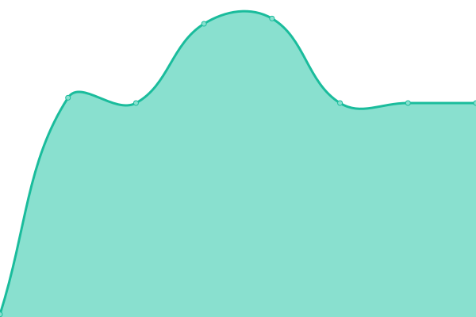

# [📈 Live Status](https://status2.rod-hosting.com): <!--live status--> **🟩 All systems operational**

This repository contains the open-source uptime monitor and status page for [rodseb](https://status2.rod-hosting.com), powered by [Upptime](https://github.com/upptime/upptime).

With [Upptime](https://upptime.js.org), you can get your own unlimited and free uptime monitor and status page, powered entirely by a GitHub repository. We use [Issues](https://github.com/rodseb/Stats/issues) as incident reports, [Actions](https://github.com/rodseb/Stats/actions) as uptime monitors, and [Pages](https://status2.rod-hosting.com) for the status page.

<!--start: status pages-->
<!-- This summary is generated by Upptime (https://github.com/upptime/upptime) -->
<!-- Do not edit this manually, your changes will be overwritten -->
<!-- prettier-ignore -->
| URL | Status | History | Response Time | Uptime |
| --- | ------ | ------- | ------------- | ------ |
|  [Site principal ROD Hosting](https://rod-hosting.com/) | 🟩 Up | [site-principal-rod-hosting.yml](https://github.com/rodseb/Stats/commits/HEAD/history/site-principal-rod-hosting.yml) | 

 1170ms
     
 | 

<a href="https://status.rod-hosting.com/history/site-principal-rod-hosting">29.72%</a>
    

|  [Serveur Panel Web](https://panel.rod-hosting.com) | 🟩 Up | [serveur-panel-web.yml](https://github.com/rodseb/Stats/commits/HEAD/history/serveur-panel-web.yml) | 

 975ms
     
 | 

<a href="https://status.rod-hosting.com/history/serveur-panel-web">15.73%</a>
    

|  Serveur Linux Jeux | 🟩 Up | [serveur-linux-jeux.yml](https://github.com/rodseb/Stats/commits/HEAD/history/serveur-linux-jeux.yml) | 

 189ms
     
 | 

<a href="https://status.rod-hosting.com/history/serveur-linux-jeux">17.08%</a>
    

|  Serveur Secondaire (matomo) | 🟩 Up | [serveur-secondaire-matomo.yml](https://github.com/rodseb/Stats/commits/HEAD/history/serveur-secondaire-matomo.yml) | 

 129ms
     
 | 

<a href="https://status.rod-hosting.com/history/serveur-secondaire-matomo">78.69%</a>
    

<!--end: status pages-->

[**Visit our status website →**](https://status2.rod-hosting.com)

## 📄 License

- Powered by: [Upptime](https://github.com/upptime/upptime)
- Code: [MIT](./LICENSE) © [rodseb](https://status2.rod-hosting.com)
- Data in the `./history` directory: [Open Database License](https://opendatacommons.org/licenses/odbl/1-0/)
